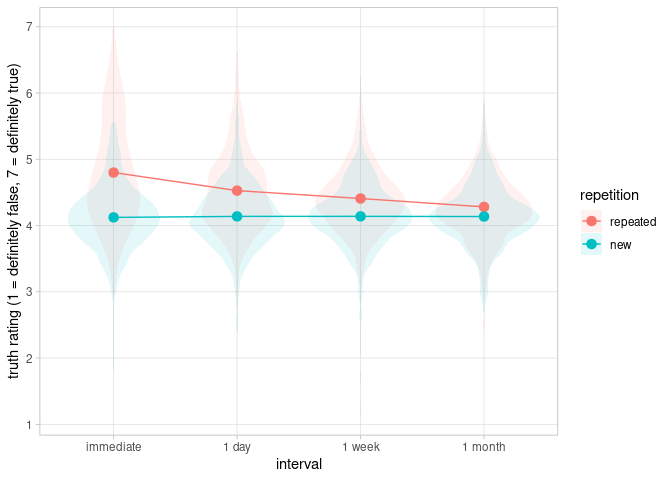

<!-- README.md is generated from README.Rmd. Please edit that file -->

# truthiness

<!-- badges: start -->

<!-- badges: end -->

The truthiness package contains data, code, and utilities related to the
Longitudinal Illusory Truth study by Henderson, Simons, and Barr (2021).
The package includes anonymized data from the study, the key
preprocessing and analysis scripts that underlie the published results,
tables describing the design of the study in full detail, and functions
for data simulation that the authors used in study planning. The package
was created to enable verification of the analytical methods, to
facilitate reproduction of the main findings, and to encourage
replication, extension, and further exploration of a rich longitudinal
dataset on the Illusory Truth phenomenon.

The Illusory Truth phenomenon is the tendency of people to consider
statements they have heard before as more likely to be true relative to
novel statements (Hasher, Goldstein, & Toppino, 1977). Our study
examined the persistence of this effect across four time intervals:
immediately, one day, one week, and one month following exposure. Five
hundred and sixty seven participants saw 64 out of 128 statements of
ambiguous veracity during an exposure phase, and later rated the full
set of statements on a scale from 1 (definitely false) to 7 (definitely
true). (Each repeated statement was repeated only once, at one of the
four intervals.)

More details about the study can be found in the project repository at
<https://osf.io/nvugt/> and in the [article at the Journal of
Cognition](http://doi.org/10.5334/joc.161).

## Installation

Package version 1.2.5 is available on the [Comprehensive R Archive
Network
(CRAN)](https://cran.r-project.org/web/packages/truthiness/index.html).
Install it using:

``` r
install.packages("truthiness")
```

We put a lot of effort into making our data and analysis scripts readily
available. If you find this package useful in your work, please cite the
paper:

Henderson, Emma L., Simons, Daniel J., and Barr, Dale J. (2021). The
trajectory of truth: A longitudinal study of the Illusory Truth Effect.
*Journal of Cognition*, *4*, 29. <http://doi.org/10.5334/joc.161>

``` 
  @Article{,
    title = {The trajectory of truth: A longitudinal study of the Illusory Truth Effect},
    author = {Emma L. Henderson and Daniel J. Simons and Dale J. Barr},
    journal = {Journal of Cognition},
    year = {2021},
    volume = {4},
    pages = {29},
    url = {http://doi.org/10.5334/joc.161},
  }
```

If you encounter any problems using the package, or have any
suggestions, please file an issue at the [package development site on
github](https://github.com/dalejbarr/truthiness).

## Basic Usage

All of the datasets collected during Stage 2 of the study are included
in the package, in four data objects:

  - `sessions`: information about each participant
  - `phases`: information about each participant’s performance in each
    phase
  - `cjudgments` : category judgments (exposure task)
  - `ratings` : truth ratings

Information about the design of the study is available in these objects:

  - `stimulus_materials` : list of statements used in the study
  - `presentation_lists` : presentation lists used for counterbalancing
  - `stimulus_conditions` : which condition each statement appeared in
    within each presentation list
  - `stimulus_categories` : the correct categorizations for each
    statement

Finally, the fitted model objects from the analysis have also been made
available:

  - `truth_trajectory_models` : cumulative link mixed-effects models
    (CLMMs) fitted to the data for analysis

See the help documentation `?truth_trajectory_data`,
`?truth_trajectory_design`, and `?truth_trajectory_models` for further
information.

### Reproducing the findings

Re-run the analysis script on the data and produce an HTML report of the
results using `reproduce_analysis()`.

``` r
library(truthiness)

report <- reproduce_analysis()
browseURL(report) # view the report in your browser
```

Alternatively, you can access the R Markdown file through the RStudio
interface using *File -\> New File -\> R Markdown… -\> From Template -\>
Illusory Truth Analysis.*

### Exploring and visualizing the data

The code below calculates the illusory truth trajectory for each
participant, and plots the distribution of participant means along with
the cell means.

``` r
library(truthiness)
library(tidyverse)
#> ── Attaching packages ──────────────────────────────────────────────────────────────────────────── tidyverse 1.3.0 ──
#> ✔ ggplot2 3.3.3          ✔ purrr   0.3.4     
#> ✔ tibble  3.1.2          ✔ dplyr   1.0.6     
#> ✔ tidyr   1.1.3          ✔ stringr 1.4.0     
#> ✔ readr   1.9.9.9000     ✔ forcats 0.5.1
#> ── Conflicts ─────────────────────────────────────────────────────────────────────────────── tidyverse_conflicts() ──
#> ✖ readr::edition_get()   masks testthat::edition_get()
#> ✖ dplyr::filter()        masks stats::filter()
#> ✖ purrr::is_null()       masks testthat::is_null()
#> ✖ dplyr::lag()           masks stats::lag()
#> ✖ readr::local_edition() masks testthat::local_edition()
#> ✖ dplyr::matches()       masks tidyr::matches(), testthat::matches()

## combine info from tidy tables
all_ratings <- ratings %>%
  inner_join(phases, c("ID", "phase_id")) %>%
  filter(keep) %>%                         # apply exclusions
  inner_join(sessions, "ID") %>%           # link to participant-level info
  inner_join(stimulus_conditions,          # map to experimental condition
             c("list_id", "stim_id")) %>% 
  select(ID, repetition, interval, trating)

## calculate subject means
subj_means <- all_ratings %>%
  group_by(ID, repetition, interval) %>%
  summarize(mean_rating = mean(trating), .groups = "drop")

## calculate cell means
cell_means <- subj_means %>%
  group_by(repetition, interval) %>%
  summarize(mean_rating = mean(mean_rating), .groups = "drop")

ggplot(subj_means,
       aes(interval, mean_rating)) +
  geom_violin(aes(fill = repetition), color = NA,
              alpha = .1, position = "identity") +
  geom_point(aes(color = repetition), data = cell_means, size = 3) +
  geom_line(aes(color = repetition, group = repetition), data = cell_means) +
  labs(y = "truth rating (1 = definitely false, 7 = definitely true)") +
  scale_y_continuous(breaks = 1:7) +
  theme_light() +
  theme(panel.grid.minor.y = element_blank())
```



## References

Hasher, Lynn, Goldstein, David, and Toppino, Thomas (1977). [Frequency
and the conference of referential
validity.](https://doi.org/10.1016/S0022-5371\(77\)80012-1) *Journal of
Verbal Learning and Verbal Behavior*, *16*, 107–112.

Henderson, Emma L., Simons, Daniel J., and Barr, Dale J. (2021). [The
trajectory of truth: A longitudinal study of the Illusory Truth
Effect.](http://doi.org/10.5334/joc.161). *Journal of Cognition*, *4*,
29.
